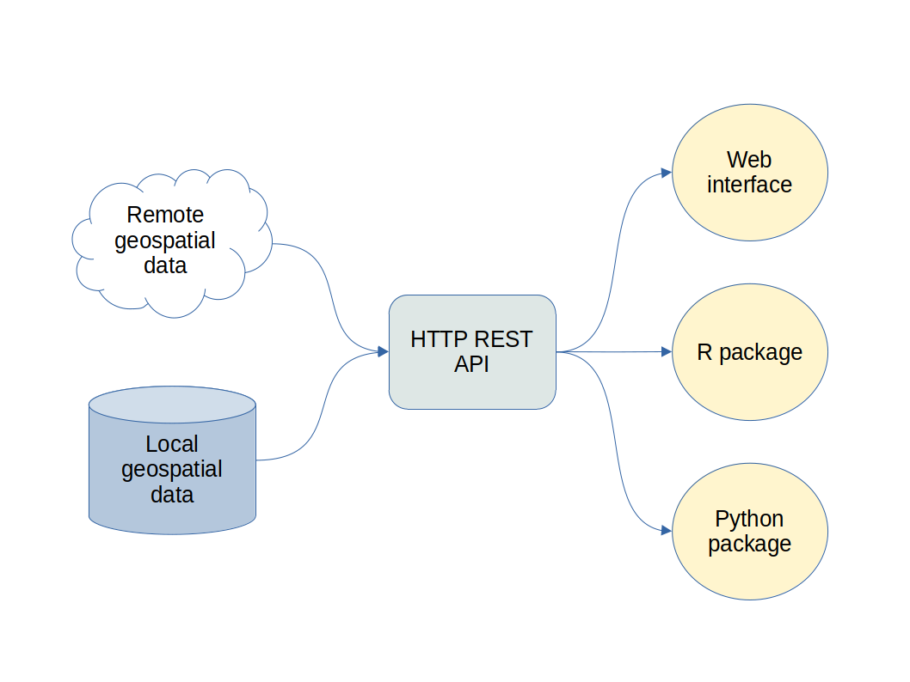

```{r setup, include=FALSE}
knitr::opts_chunk$set(
  echo = TRUE,
  collapse = TRUE,
  comment = "#>",
  fig.path = "assets/R_GCDL_pilot_tutorial/"
)
```

<!--
---
title: GeoCDL Pilot Tutorial
layout: single
author: Heather Savoy
author_profile: true
header:
  overlay_color: "444444"
  overlay_image: /assets/images/margaret-weir-GZyjbLNOaFg-unsplash_dark.jpg
---
--> 

**Last Update:** 23 May 2022 <br />
**Download RMarkdown**: [R_GCDL_pilot_tutorial.Rmd](https://geospatial.101workbook.org/tutorials/R_GCDL_pilot_tutorial.Rmd)

<!-- ToDo: would be great to have an R binder badge here -->

## Overview

This tutorial covers the SCINet Geospatial Common Data Library (GeoCDL), a community project from the [Geospatial Research Working Group](https://scinet.usda.gov/working-groups/geospatial) to reduce the time and effort to access commonly used geospatial datasets. 

{width=100%}

This example covers the pilot features implemented in the GeoCDL web API v0.1.0. The tutorial assumes you are either on CERES or a local machine connected to the [SCINet VPN](https://scinet.usda.gov/guide/vpn). For more details on the development of the web API, see [https://github.com/USDA-SCINet/geocdl/](https://github.com/USDA-SCINet/geocdl/) (request access from brian.stucky@usda.gov).

To learn more about the `R` package `rgcdl` in development to streamline these requests, see [https://github.com/USDA-SCINet/rgcdl/](https://github.com/USDA-SCINet/rgcdl/)


*Language:* `R`

*Primary Libraries/Packages:*

| Name | Description | Link |
|:--|:--|:--|
| raster | Geographic Data Analysis and Modeling | https://cran.r-project.org/web/packages/raster/index.html |
| sf | Simple Features for R | https://cran.r-project.org/web/packages/sf/index.html |
| jsonlite | jsonlite: A Simple and Robust JSON Parser and Generator for R | https://cran.r-project.org/web/packages/jsonlite/index.html |

## Nomenclature

* *Web API:* < Description >
* *Data access protocol:* < Description >
* *Coordinate Reference System (CRS):* < Description >
* *EPSG code:* 

## Data Details

* Data: MODIS NDVI Data, Smoothed and Gap-filled, for the Conterminous US: 2000-2015
* Link: [https://doi.org/10.3334/ORNLDAAC/1299](https://doi.org/10.3334/ORNLDAAC/1299)
* Other Details: This dataset is acquired via the GeoCDL. It is 70.8 GB, but the GeoCDL leverages data access protocols to access the dataset remotely from online servers, use server-side functions for basic spatial and temporal filtering, and download the user's requested subset of data. The GeoCDL finishes more detailed subsetting of the data to match the user's request.

* Data: PRISM
* Link: [https://prism.oregonstate.edu/](https://prism.oregonstate.edu/)
* Other Details: This dataset's daily, monthly, and annual 4 km resolution products are stored on CERES in their native format and amount to XX Tb. The GeoCDL subsets the files relevant to the user's request. For this tutorial, we will be accessing the monthly precipitation and maximum temperature files. 

* Repository: < Link to Repository >
* Data: < Name of Dataset >
* Link: < Link to the dataset >
* Other Details: < other >

## Tutorial Steps

* Specify desired data - Define the spatio-temporal scope of the user request:
  * Dataset and variables
  * Temporal coverage 
  * Spatial coverage, spatial resolution, and CRS
* Build GeoCDL query - Format request for the web API
* Download requested data - Send request to server and download compressed folder with results
* Visualize results - View the downloaded data and metadata

## Step 0: Import Libraries/Packages

```{r libraries, message=FALSE, warning=FALSE}
library(raster) ## consider stars or terra instead
library(sf)
library(jsonlite)
library(tidyverse)
library(ggthemes)
library(httr)
```

## Step 1: Point to Web API

The GeoCDL Web API lives on a CERES service node that can be accessed by ... It has multiple endpoints, each of which will be showcased below. 

```{r step1}
# Web API address
gcdl_url <- 'http://127.0.0.1:8000/'

# Geometry upload endpoint: for uploading user geometries
geom_ep <- 'upload_geom'

# Subset polygon endpoint: for requesting gridded data within an area
polygon_ep <- 'subset_polygon'

# Point subset endpoint: for requesting point data extracted from grid
points_ep <- 'subset_points'

```


## Step 2: Specify area and date range of interest 

We will focus on the USDA-ARS Jornada Experimental Range in southern New Mexico. This tutorial will showcase returning both gridded data overlapping the site and point data at experiment locations within the site. GeoCDL v0.1.0 supports user geometry (polygon or points) definitions as either 1) formatted strings of coordinates or 2) user-uploaded files in the format of CSV, shapefile, and geoJSON. To specify our geometries, we will use a shapefile of the site boundary and a shapefile of experiment locations. These shapefiles are in UTM 13N CRS, which GeoCDL will detect. [*it would be nice if I could link to specific parts of our web api documentation*]

```{r step2_geometry, warning=FALSE}
# Upload the shapefile and retrieve a geometry upload identifier
jer_bounds_zip <- 'assets/R_GCDL_pilot_tutorial/Boundary2.zip'
guid_r <- POST(paste0(gcdl_url,geom_ep), 
          body = list(geom_file = upload_file(jer_bounds_zip)), 
          encode = "multipart")
area_guid <- content(guid_r)$geom_guid

# Read in Jornada NPP locations shapefile and format coordinates for GeoCDL
jer_pts_f <- 'assets/R_GCDL_pilot_tutorial/NPP_sites.shp'
jer_pts <- st_read(jer_pts_f) 
pts_str <- jer_pts  %>% 
  st_coordinates() %>% 
  as_tibble() %>% 
  mutate_all(~round(.,2)) %>% 
  rowwise() %>% 
  mutate(coord = paste0("(",X,",",Y,")")) %>% 
  ungroup() %>% 
  pull(coord) %>% 
  paste0(collapse = ",")


```


We will also specify a target spatial resolution in which we would like all data layers returned. The target CRS for the returned data layers will be UTM 13N CRS like our geometries, although you have an option to specify another CRS if desired. Since UTM CRSs have meter units, that is the expected unit for spatial resolution. Since resampling of the data will happen by changing target resolution and CRS, you can specify the resampling method to be used. By default, it is the 'nearest' method which is the least computationally-expensive method. 


```{r step2_space, warning=FALSE}

s_res <- 1000 # meters
resample_method <- 'bilinear'

```

For this example, we will request data from the Apr-Sep growing seasons in 2000-2010. The GeoCDL accepts date definitions by providing either: 1) a start and end date or 2) ranges of years and months or days. The first method is helpful when the user wants all data within a simple range of time and the desired temporal resolution can be dictated by the format of the dates: 'YYYY' for annual, 'YYYY-MM' for monthly, and 'YYYY-MM-DD' for daily data. The second method is more flexible and is better suited for our growing season example: we can specify our year range as '2000-2010' and our month range as '4-9'. By specifying months, we are telling the GeoCDL we are interested in monthly data so it will know to access the monthly PRISM files on Ceres as opposed to the daily or annual files. However, the MODIS NDVI product has data every 8 days (*confirm*). The GeoCDL categorizes this as daily data since it is associated with a specific day. By default, GeoCDL checks if all requested datasets have data products matching the requested temporal resolution and returns an error if at least one does not (e.g. our example of requesting monthly data but NDVI only available as daily products). To change this default behavior, the `grain_method` parameter can be specified to tell GeoCDL what temporal resolutions to allow. To tell GeoCDL that we want it to return daily NDVI, we can specify either 'finer' or 'any' in this case since daily is the only option.

```{r step2_time}
# Define time of interest and temporal resolution as monthly
yrs <- '2019' #change to 2000:2010 when data available
mnths <- '7:8'   #change to 4:9 when data available

# Allow sparse daily NDVI to be returned by specifying that
# finer than indicated temporal resolutions can be returned
g_method <- 'finer' 

```

## Step 3: Select datasets and their variables

The GeoCDL can be queried to return the currently available datasets and their metadata. We will be using the MODIS NDVI Data, Smoothed and Gap-filled, for the Conterminous US: 2000-2015 data product which is stored under the ID *MODIS_NDVI*.
We can see from its metadata that this dataset has a ... CRS, different from our area of interest objects. The GeoCDL will accommodate the discrepancy. The metadata also indicates that there is just one variable: NDVI. We will format the dataset and variable list in the expected format of `DATASET_ID:VARNAME[,VARNAME...][;DATASET_ID:VARNAME[,VARNAME...]...]`.

```{r step3}
# 1, Query the GeoCDL to list all datasets
(all_datasets <- fromJSON(url(paste0(gcdl_url,'list_datasets'))) %>%
  as_tibble())
my_ds <- c('DaymetV4','PRISM') #

# 2. View a dataset's metadata
fromJSON(url(paste0(gcdl_url,'ds_info?id=',my_ds[2])))
my_vars <- list(c('prcp'), c('ppt','tmax')) #list(c('prcp'), c('ppt'))

# 3. Format datasets and variables
(dv_str <- tibble(dataset = my_ds,
                 variable = my_vars) %>%
  unnest(variable) %>%
  group_by(dataset) %>%
  summarise(dv = paste0(unique(dataset),':',paste(variable,collapse = ','))) %>%
  ungroup() %>%
  summarise(dv = paste0(dv,collapse = ";")) %>%
  pull(dv))

```

## Step 4: Build and submit request to GeoCDL

Now that we've defined and formatted the pieces of the request, we can merge them into a request URL to communicate with the GeoCDL. The `download.file` function accepts this kind of URL and downloads the returned file to the specified path. GeoCDL returns a zipped folder of the requested data plus a metadata file. 

```{r step4a}
#  Prepare polygon query
q_str <- paste0(gcdl_url,
                polygon_ep,
                '?',
                paste0(
                  'years=', yrs,
                  '&months=', URLencode(mnths, reserved = TRUE),
                  '&resolution=', 4000,
                  '&resample_method=', resample_method,
                  '&grain_method=', g_method,
                  '&datasets=',URLencode(dv_str, reserved = TRUE),
                  '&geom_guid=',area_guid))  

outpath <- 'assets/tmp'
out_z <- paste0(outpath,'.zip')

start_clock <- Sys.time()
download.file(q_str, out_z)
end_clock <- Sys.time()

# How long did the download take?
end_clock - start_clock

unzip(out_z, exdir = paste0(outpath,"/"))
```


## Step 5: Read in and visualize results from GeoCDL

```{r step5, out.width="100%"}
# Create a raster stack of returned GeoTIFFs
NDVI_2008 <- list.files(outpath,'Day[[:print:]]*.tif',full.names = TRUE) %>%
  stack() 

NDVI_2008 %>%
  as.data.frame(xy = TRUE) %>%
  # pivot_longer(contains('NDVI'),
  #              names_to = c(NA,NA,'var','date'),
  #              names_sep = c('[_]'),
  #              values_to = 'NDVI') %>%
  pivot_longer(-c(x,y),
               names_to = 'date',
               values_to = 'prcp') %>%
  ggplot() +
  geom_raster(aes(x,y,fill=prcp)) +
  #geom_sf(fill = NA,
  #        data=jer_bounds) +
  facet_wrap(~date,
             ncol=4) +
  scale_fill_gradientn(colors = rev(terrain.colors(8)),
                       na.value = 'white') +
  theme_few(base_size = 8) +
  theme(legend.position = c(0.875,0.25),
        axis.text = element_text(size = 4)) +
  ylab(NULL) +
  xlab(NULL)
```
```{r step5_prism, out.width="100%"}
# Create a raster stack of returned GeoTIFFs
PRISM_2008 <- list.files(outpath,'PRISM_ppt[[:graph:]]*.tif',full.names = TRUE) %>%
  stack() 

PRISM_2008 %>%
  as.data.frame(xy = TRUE) %>%
  pivot_longer(contains('PRISM'),
               names_to = c(NA,'var','date'),
               names_sep = c('[_]')) %>%
  ggplot() +
  geom_raster(aes(x,y,fill=value)) +
  geom_sf(fill = NA,
          data=jer_bounds) +
  facet_grid(var~date) +
  scale_fill_distiller(palette = 'Blues', 
                       direction = 1,
                       na.value = 'white') +
  theme_few(base_size = 8) +
  theme(axis.text = element_text(size = 4)) +
  ylab(NULL) +
  xlab(NULL)
```

```{r step5_stack, out.width="100%"}
# Create a raster stack of returned GeoTIFFs
all_2008 <- list.files(outpath,'.nc',full.names = TRUE) %>%
  stack() 

all_2008 %>%
  plot()
```


```{r step4b}
#  Prepare point query
q_str <- paste0(gcdl_url,
                points_ep,
                '?',
                paste0(
                  'years=',yrs,
                  '&months=',mnths,
                  '&grain_method=',g_method,
                  '&datasets=',URLencode(dv_str, reserved = TRUE),
                  '&output_format=','netcdf',
                  '&points=',URLencode(pts_str, reserved = TRUE)))  

outpath <- 'assets/tmp'
out_z <- paste0(outpath,'.zip')

start_clock <- Sys.time()
download.file(q_str, out_z)
end_clock <- Sys.time()

# How long did the download take?
end_clock - start_clock

unzip(out_z, exdir = paste0(outpath,"/"))
```

```{r step5b, message=FALSE, warning=FALSE, out.width="100%"}
# Read in returned shapefile
MODIS_PRISM_pts <- read_csv(paste0(outpath,'/MODIS_NDVI_PRISM.csv')) 

MODIS_PRISM_pts %>%
  filter(variable == "prcp") %>%
  mutate(time = as.Date(time)) %>%
  ggplot(aes(time,value)) +
  geom_line(aes(group=paste(x,y)), # to help with grouping
            color = "gray50",
            size = 0.25) +
  geom_point(aes(color=value),
             size = 2) + 
  scale_color_gradientn(name = 'NDVI',
                        colors = rev(terrain.colors(8)),
                       na.value = 'white') +
  theme_few(base_size = 8) +
  theme(legend.position = c(0.25,0.75)) 

daymet_prism_shp <- st_read(paste0(outpath,'/MODIS_NDVI_PRISM.shp'))
ggplot() +
   geom_sf(fill = NA,
          data=jer_bounds) +
  geom_sf(aes(color = value),
          data=daymet_prism_shp %>%
            filter(dataset == "MODIS_NDVI")) +
  facet_wrap(~time) +
  theme_few()

library(tidync)
#daymet_prism_nc <- st_read(paste0(outpath,'/MODIS_NDVI_PRISM.nc'))
nc_open(paste0(outpath,'/MODIS_NDVI_PRISM.nc'))
daymet_prism_nc <- tidync(paste0(outpath,'/MODIS_NDVI_PRISM.nc')) 
print(daymet_prism_nc)

MODIS_PRISM_pts  %>% distinct(x,y) ### NOT THE SAAME BETWEEEN DATASETS. REPROGJECTION OR ROUNDING ERROR?

MODIS_PRISM_pts %>%
  filter(variable == "NDVI") %>%
  filter(time == '2008-08-24') %>%
  ggplot(aes(x,y,color=value,size=value)) +
  geom_point() +
  scale_color_gradientn(name = 'NDVI',
                        colors = rev(terrain.colors(8))) +
  theme_few()
```


